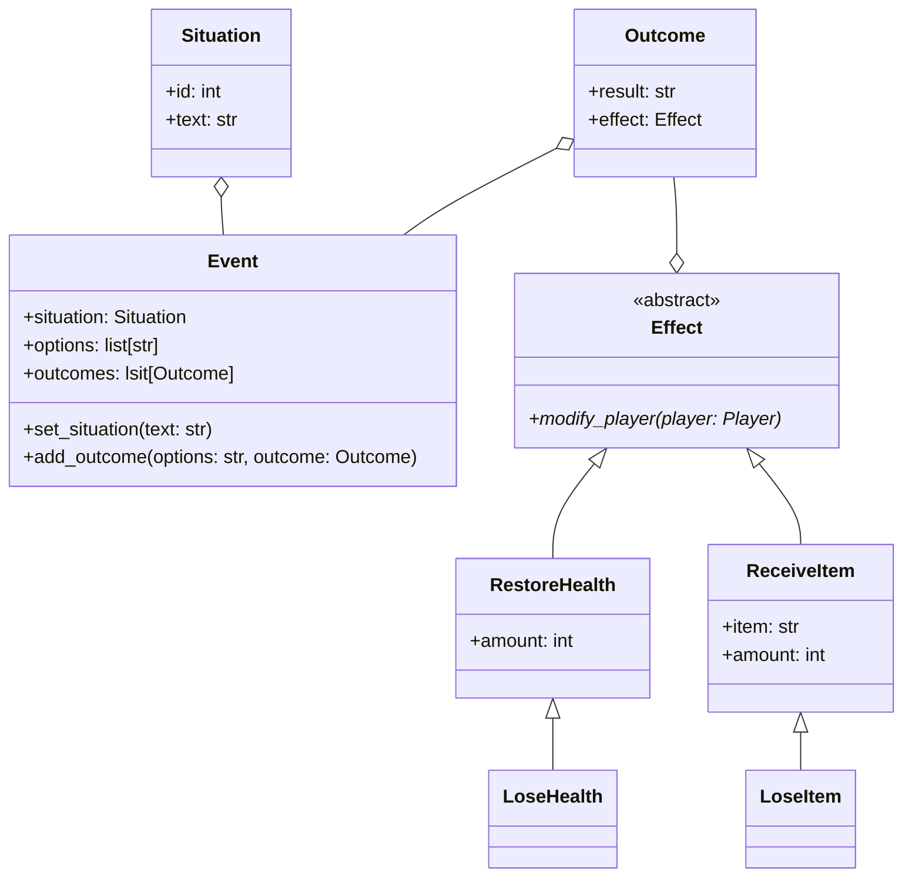

```mermaid
classDiagram
    class Effect{
        <<abstract>>
        +modify_player(player: Player)*
    }
    class RestoreHealth{
        +amount: int
    }
    class ReceiveItem{
        +item: str
        +amount: int
    }

    Effect <|-- RestoreHealth 
    RestoreHealth <|-- LoseHealth
    Effect <|-- ReceiveItem 
    ReceiveItem <|-- LoseItem 


    class Situation{
        +id: int
        +text: str
    }

    class Outcome{
        +result: str
        +effect: Effect
    }

    class Event{
        +situation: Situation
        +options: list[str]
        +outcomes: lsit[Outcome]
        +set_situation(text: str)
        +add_outcome(options: str, outcome: Outcome)
    }

    Situation o-- Event
    Outcome o-- Event
    Outcome --o Effect
        
```