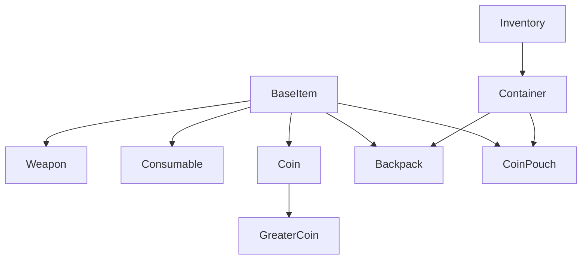
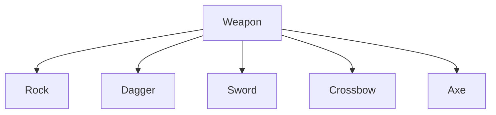
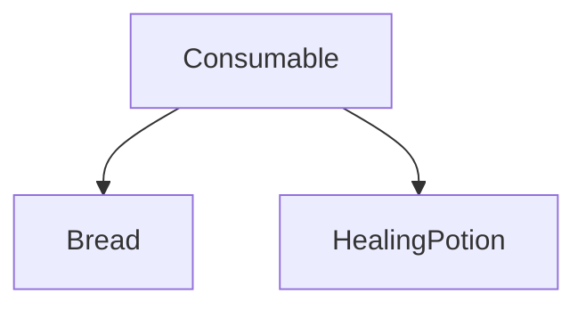
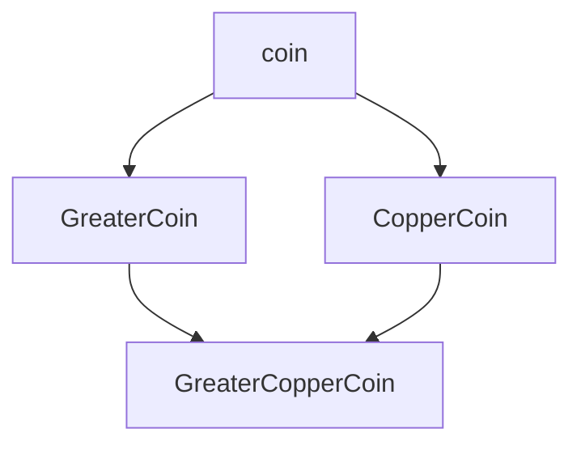

```mermaid
graph TD;
    BaseItem-->Weapon;
    BaseItem-->Consumable;
    BaseItem-->Coin;
        Coin-->GreaterCoin;

    Inventory-->Container;
    BaseItem-->Backpack;
    Container-->Backpack;
    BaseItem-->CoinPouch;
    Container-->CoinPouch;
```

```mermaid
graph TD;
    Weapon-->Rock;
    Weapon-->Dagger;
    Weapon-->Sword;
    Weapon-->Crossbow;
    Weapon-->Axe;
```

```mermaid
graph TD;
    Consumable-->Bread;
    Consumable-->HealingPotion;
```

```mermaid
graph TD;
    coin-->GreaterCoin;
    coin-->CopperCoin;
    GreaterCoin-->GreaterCopperCoin;
    CopperCoin-->GreaterCopperCoin;
```