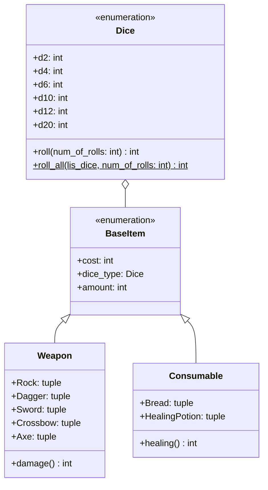

```mermaid
classDiagram
    class Dice{
        <<enumeration>>
        +d2: int
        +d4: int
        +d6: int
        +d10: int
        +d12: int
        +d20: int
        +roll(num_of_rolls: int) int
        +roll_all(lis_dice, num_of_rolls: int)$ int
    }

    class BaseItem{
        <<enumeration>>
        +cost: int
        +dice_type: Dice
        +amount: int
    }

    class Weapon{
        +Rock: tuple
        +Dagger: tuple
        +Sword: tuple
        +Crossbow: tuple
        +Axe: tuple
        +damage() int
    }

    class Consumable{
        +Bread: tuple
        +HealingPotion: tuple
        +healing() int
    }

    Dice o-- BaseItem
    BaseItem <|-- Weapon
    BaseItem <|-- Consumable
```
