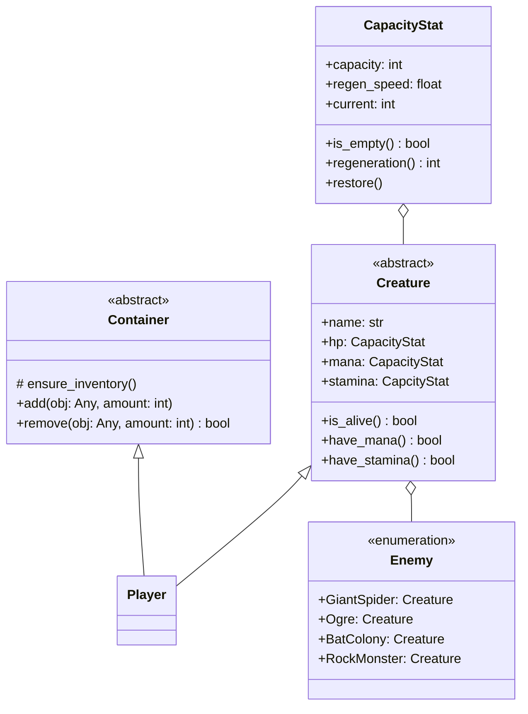

```mermaid
classDiagram
    class CapacityStat{
        +capacity: int
        +regen_speed: float
        +current: int
        +is_empty() bool
        +regeneration() int
        +restore()
    }

    class Creature{
        <<abstract>>
        +name: str
        +hp: CapacityStat
        +mana: CapacityStat
        +stamina: CapcityStat
        +is_alive() bool
        +have_mana() bool
        +have_stamina() bool
    }

    class Enemy{
        <<enumeration>>
        +GiantSpider: Creature
        +Ogre: Creature
        +BatColony: Creature
        +RockMonster: Creature
    }

    class Container{
        <<abstract>>
        # ensure_inventory()
        +add(obj: Any, amount: int)
        +remove(obj: Any, amount: int) bool
    }

    Container <|-- Player
    Creature <|-- Player
    CapacityStat o-- Creature
    Creature o-- Enemy
```