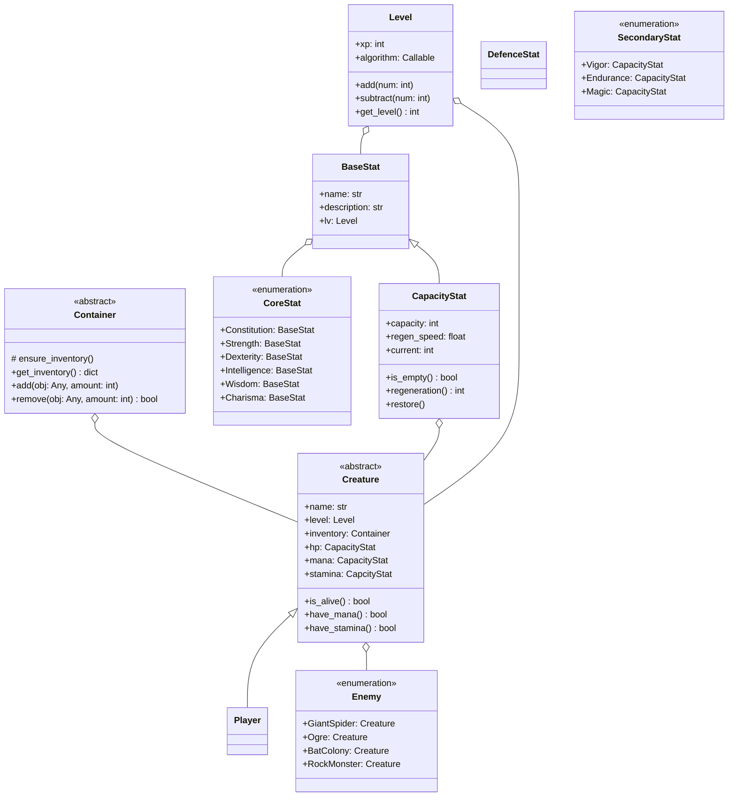

```mermaid
classDiagram
    class Level{
        +xp: int
        +algorithm: Callable
        +add(num: int)
        +subtract(num: int)
        +get_level() int
    }

    class BaseStat{
        +name: str
        +description: str
        +lv: Level
    }

    class CapacityStat{
        +capacity: int
        +regen_speed: float
        +current: int
        +is_empty() bool
        +regeneration() int
        +restore()
    }

    class DefenceStat{

    }

    Level o-- BaseStat
    BaseStat <|-- CapacityStat


    %%PrimaryStat
    class CoreStat{
        <<enumeration>>
        +Constitution: BaseStat
        +Strength: BaseStat
        +Dexterity: BaseStat
        +Intelligence: BaseStat
        +Wisdom: BaseStat
        +Charisma: BaseStat
    }

    class SecondaryStat{
        <<enumeration>>
        +Vigor: CapacityStat
        +Endurance: CapacityStat
        +Magic: CapacityStat
    }

    BaseStat o-- CoreStat

    class Creature{
        <<abstract>>
        +name: str
        +level: Level
        +inventory: Container
        +hp: CapacityStat
        +mana: CapacityStat
        +stamina: CapcityStat
        +is_alive() bool
        +have_mana() bool
        +have_stamina() bool
    }

    class Enemy{
        <<enumeration>>
        +GiantSpider: Creature
        +Ogre: Creature
        +BatColony: Creature
        +RockMonster: Creature
    }

    class Container{
        <<abstract>>
        # ensure_inventory()
        +get_inventory() dict
        +add(obj: Any, amount: int)
        +remove(obj: Any, amount: int) bool
    }


    Creature <|-- Player
    Container o-- Creature
    CapacityStat o-- Creature
    Creature o-- Enemy
    Level o-- Creature

```