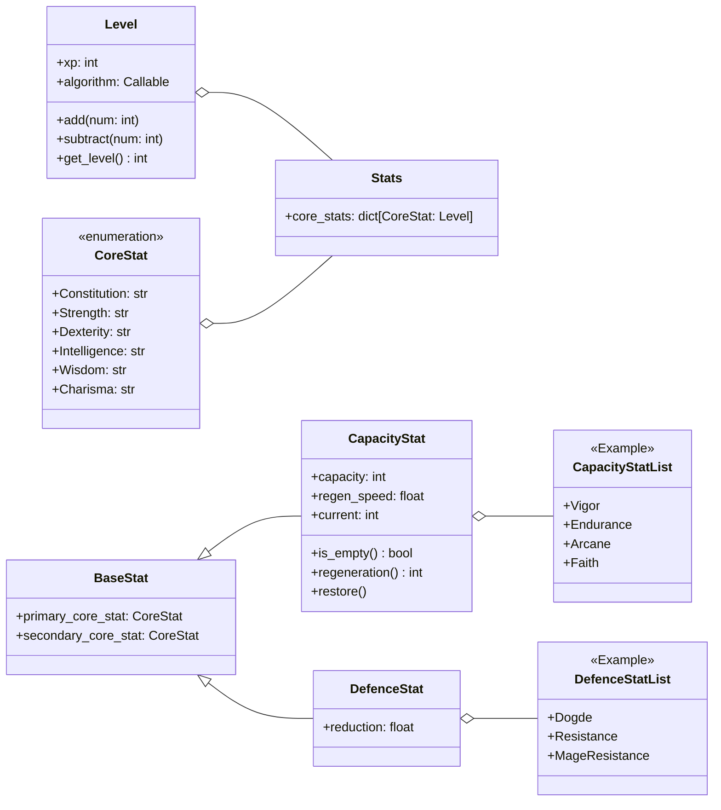

```mermaid
classDiagram
    direction LR

    class Level{
        +xp: int
        +algorithm: Callable
        +add(num: int)
        +subtract(num: int)
        +get_level() int
    }


    class CoreStat{
        <<enumeration>>
        +Constitution: str
        +Strength: str
        +Dexterity: str
        +Intelligence: str
        +Wisdom: str
        +Charisma: str
    }


    class BaseStat{
        +primary_core_stat: CoreStat
        +secondary_core_stat: CoreStat
    }

    class Stats{
        +core_stats: dict[CoreStat: Level]
    }

    Level o-- Stats
    CoreStat o-- Stats

    class CapacityStat{
        +capacity: int
        +regen_speed: float
        +current: int
        +is_empty() bool
        +regeneration() int
        +restore()
    }

    BaseStat <|-- CapacityStat

    class CapacityStatList{
        <<Example>>
        +Vigor
        +Endurance
        +Arcane
        +Faith    
    }

    CapacityStat o-- CapacityStatList

    class DefenceStat{
        +reduction: float
    }

    BaseStat <|-- DefenceStat

    class DefenceStatList{
        <<Example>>
        +Dogde
        +Resistance
        +MageResistance
    }

    DefenceStat o-- DefenceStatList
    
    
```